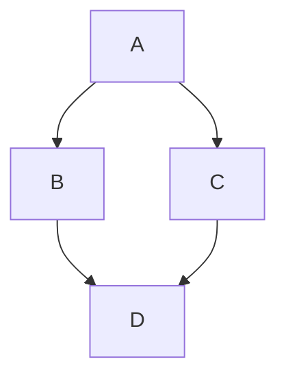

Stack theme also provides some custom shortcodes to enhance your content.

<!--more-->

## Quote

The `quote` shortcode allows you to display a quote with an author, source, and URL.


Lorem ipsum dolor sit amet, consectetur adipiscing elit, sed do eiusmod tempor incididunt ut labore et dolore magna aliqua.


### Usage

```markdown

Quote content here.

```

## Video

The `video` shortcode allows you to embed self-hosted or remote video files.



### Usage

```markdown

```

## Bilibili

Embed videos from Bilibili. Supports both `av` and `bv` IDs.



### Usage

```markdown

```

## YouTube

Hugo's built-in YouTube shortcode.



### Usage

```markdown

```

## Tencent Video

Embed videos from Tencent Video.



### Usage

```markdown

```

## GitLab Snippet

Embed snippets from GitLab.



### Usage

```markdown

```

## GitHub Repo Card

Show a repository card with build-time fetched GitHub metadata.





### Usage

```markdown


```

## Diagrams

Stack supports [Mermaid](https://mermaid.js.org/) diagrams out of the box.



### Usage

Wrap your Mermaid code in a code block with the language set to `mermaid`.

<pre><code>```mermaid
graph TD;
    A-->B;
    A-->C;
    B-->D;
    C-->D;
```</code></pre>
