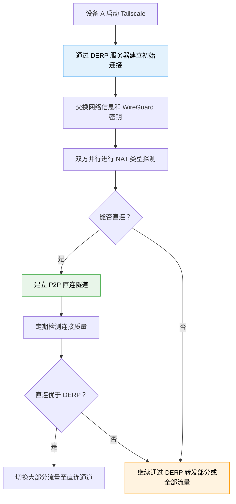

This is a test post to verify Mermaid diagram rendering in Hugo.

```mermaid
flowchart TD
    A[设备 A 启动 Tailscale] --> B[通过 DERP 服务器建立初始连接]
    B --> C[交换网络信息和 WireGuard 密钥]
    C --> D[双方并行进行 NAT 类型探测]
    D --> E{能否直连？}
    E -- 是 --> F[建立 P2P 直连隧道]
    F --> G[定期检测连接质量]
    G --> H{直连优于 DERP？}
    H -- 是 --> I[切换大部分流量至直连通道]
    H -- 否 --> J[继续通过 DERP 转发部分或全部流量]
    E -- 否 --> J

    style B fill:#e3f2fd,stroke:#2196f3,color:#000
    style F fill:#e8f5e9,stroke:#4caf50,color:#000
    style J fill:#fff3e0,stroke:#ff9800,color:#000
```

